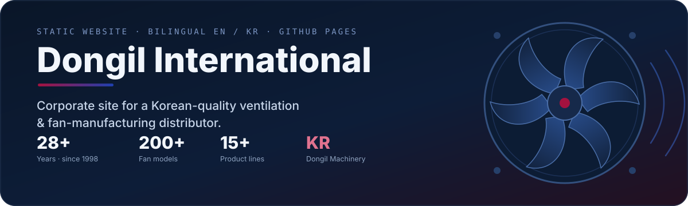
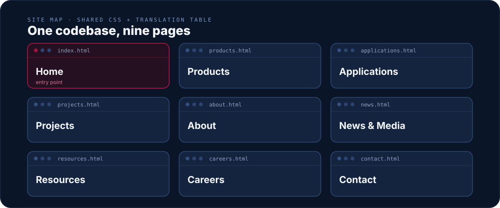

<p align="center">
  
</p>

<p align="center">
  <a href="https://xidik12.github.io/fan-manufacturer-website/"></a>
  
  
  
</p>

<p align="center">
  <b><a href="https://xidik12.github.io/fan-manufacturer-website/">View the live website →</a></b>
</p>

---

The corporate website for **Dongil International** — a Phnom Penh–based distributor of
Korean-quality ventilation fans and blowers, backed by 28+ years of manufacturing partnership
with **Dongil Machinery**. This repository is the full static site: hand-authored HTML,
one shared stylesheet, and a single bilingual (English / Korean) translation table.
No build step, no framework runtime — it ships straight to GitHub Pages.

> *"Good Air, The Better Life"* — creating wind that is beneficial to life since 1998.

<br>

<p align="center">
  
</p>

<br>


Nine hand-built pages present the company, its catalog, and its track record:

| Page | Purpose |
| --- | --- |
| **Home** (`index.html`) | Hero, applications overview, company stats, call to action |
| **Products** | Full fan catalog — centrifugal, axial, wall & residential families, plus accessories |
| **Applications** | Ventilation by environment: HVAC, industrial, kitchen exhaust, smoke extraction, parking |
| **Projects** | Prestigious installations across Cambodia and Southeast Asia (e.g. Canadia Tower) |
| **About** | Company profile, mission / vision / values, milestones, certifications |
| **News & Media** | Announcements and press |
| **Resources** | Catalogs and documentation, including Dongil Machinery certificates |
| **Careers** | Roles at the Phnom Penh office |
| **Contact** | Enquiry details and location map |

**Product families on show** — Sirocco (SS/DS), Air Foil, Duct In-Line, Roof, Wall
Ventilation, Smart Large Ceiling (HVLS), and the full centrifugal / axial ranges — 200+
models across 15+ lines, illustrated with real product renders.

Every visitor-facing string is bilingual: the language toggle (**EN / 한국어**) swaps content
live and remembers the choice in `localStorage`.

<br>


A deliberately simple, dependency-light static site — nothing to compile, nothing to serve
dynamically.

```text
fan-manufacturer-website/
├── index.html            # Home page
├── pages/                # about · applications · careers · contact · news
│                         # products · projects · resources
├── css/styles.css        # Custom styles on top of Tailwind
├── js/main.js            # Language switching + UI interactions (vanilla JS)
├── lang/translations.js  # Single EN / KO translation table (data-i18n keys)
├── images/               # Logo + product renders
└── assets/               # Certificates (PDF) and README visuals
```

- **HTML5** pages styled with **Tailwind CSS** (CDN) plus a custom `styles.css`.
- **Vanilla JavaScript** — no framework, no bundler. Interactions live in `js/main.js`.
- **i18n** via `data-i18n` attributes resolved against `lang/translations.js`.
- Brand system: crimson `#A4123F` + navy `#1e40af`, Inter typeface, Font Awesome icons.

<br>


No toolchain to install — clone and open, or serve the folder over HTTP so the language
files load cleanly.

```bash
git clone https://github.com/xidik12/fan-manufacturer-website.git
cd fan-manufacturer-website

# Option A — just open it
open index.html

# Option B — serve locally (recommended; avoids file:// fetch limits)
python3 -m http.server 8000
# then visit http://localhost:8000
```

**Deploy** — the site is published with **GitHub Pages** from the default branch. Any push
updates the live site at
[`xidik12.github.io/fan-manufacturer-website`](https://xidik12.github.io/fan-manufacturer-website/).
To point a custom domain at it, add a `CNAME` file and configure DNS.

<br>

---

<p align="center">
  <sub><b>Dongil International</b> · Phnom Penh, Cambodia · Est. 1998 — <i>Good Air, The Better Life</i></sub>
</p>
